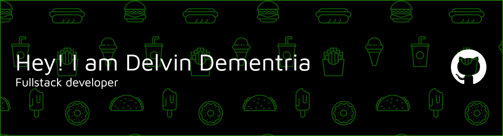

# 💫 About Me:

🎯 Hello everyone! My name is Muhammad Delvin Dementria.  
🎤 My hobbies are basketball, playing guitar, playing video games, and listening to music.  
📸 I’m a fan of JKT48, and my oshi is Grace Octaviani.  
🚩 Languages: Indonesian, English, Japanese.  

# 💻 Tech Stack:

### 🎨 Frontend

### ⚙️ Backend

### 📱 Mobile

### 🛠 Tools & Others

---

# 📊 GitHub Stats:

 

 

# 📽️My Project

## 😊Portofolio Website
- [Portofolio-Website](https://starvinn.github.io/Portofolio-Website/)
## 🏫School Project :

### 🧑‍💻Pemrograman Web Dasar (PWD):
| Project Name          | Repository Link                                                 | Contributors  | Language / Framework           |
| --------------------- | --------------------------------------------------------------- | ------------- | ------------------------------ |
| Test API and Frontend | [Test_Api_And_FrontEnd](https://github.com/StarVinn/Tugas_Fe_Api_Laravel) | Delvin | Laravel, Tailwind CSS, JavaScript    |
| Restaurant Management | [Restaurant_Management](https://github.com/StarVinn/RestaurantManagement) | Delvin | Laravel, Tailwind CSS             |
| SISFO SARPRAS Web     | [Sisfo_Sarpras_Web](https://github.com/StarVinn/sisfo-sarpras-web)    | Delvin | Laravel, Tailwind CSS, JavaScript         |

### 🧑‍💻Pemrograman Berbasis Object (PBO):
| Project Name         | Repository Link                                                 | Contributors  | Language / Framework |
| -------------------- | --------------------------------------------------------------- | ------------- | -------------------- |
| Al-Quran API         | [Alquran_Api](https://github.com/StarVinn/flutter-api-alquran)  | Delvin | Flutter, Dart        |
| Starbhak Mart        | [Starbhak_Mart](https://github.com/StarVinn/pbo)                  | Delvin | Flutter, Dart          |
| SISFO SARPRAS Mobile | [Sisfo_Sarpras_Mobile](https://github.com/StarVinn/sisfo-sarpras-mobile) | Delvin | Flutter, Dart        |

##  JKT48 Side Project:

### 😇🎯Created By Me :

### Website 
- [JKT48_Website](https://github.com/StarVinn/JKT48_API_MEMBERS)
### Wallpaper Desain

    
    
    
    
    
     
    
    

<!-- ### Favorite Desain :

    
    
    
    
    

 -->

